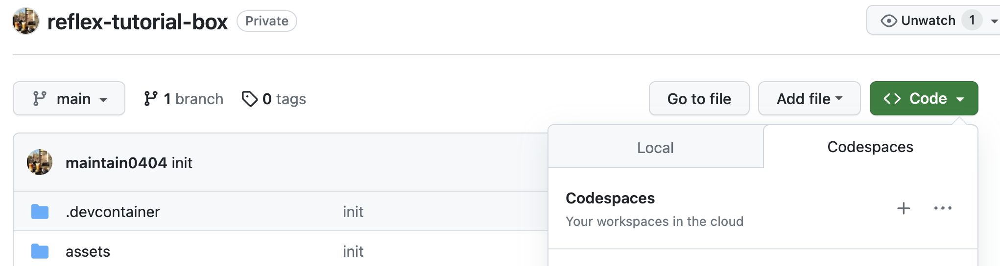

# 프로젝트 세팅

## 직접 세팅하기

### poetry 프로젝트 설정

1. `tutorial` 디렉토리 생성 후 진입
    
    <aside>
    💡 모든 파일 경로와 스크립트 실행 위치는 이 디렉토리를 기준으로 합니다.

    디렉토리 이름이 다르다면 후술할 tutorial 디렉토리와 그 아래 `tutorial.py` 파일이름이 변경된 디렉토리 이름에 맞게 변경됩니다.
    
    </aside>
    
2. 프로젝트 시작
    
    ```bash
    poetry init  # 프로젝트 이름을 위에서 생성한 디렉토리 이름과 동일하게 진행해주세요
    ```
    
3. reflex 설치
    
    ```bash
    poetry add reflex
    ```
    

### python만 사용해서 설정

1. 가상환경 설정(필수 아니나 권장)
    
    ```bash
    # 가상환경 생성
    # 나중에 .gitignore에 추가해주세요
    python -m venv .reflex-venv
    
    # 활성화
    # macOS, Linux, Cygwin 등 Unix-like
    source .reflex-venv/bin/activate
    # 윈도우
    .reflex-venv/Scripts/activate.bat
    ```
    
2. reflex 설치
    
    ```bash
    pip install reflex
    ```
    

### conda 사용

1. conda 가상환경 생성 및 활성화
    
    ```bash
    # 가상환경 생성
    conda create -n .reflex-venv python=3.11
    
    # 활성화
    conda activate .reflex-venv
    ```
    
2. reflex 설치
    
    ```bash
    pip install reflex
    ```
    

## 준비된 설정 및 Codespace 사용(Github Codespace + devcontainer)

<aside>
💡 Github 계정이 필요합니다.

2cpu 기준 60시간 무료입니다.

devcontainer를 사용하실 줄 안다면 로컬 환경에서 설정하셔도 좋습니다.

</aside>

1. [리포지토리](https://github.com/maintain0404/reflex-tutorial-box)에서 초록색 코드를 누릅니다.
     
2. codespace를 선택하고 `+` 를 눌러 환경을 추가합니다.
3. 환경 추가 및 프로비저닝 완료까지 기다립니다.
4. reflex를 설치합니다.
    
    ```python
    pip install reflex
    ```
    

## 이미지 에셋 준비하기

1. 준비된 설정으로 진행했다면 생략해도 무관합니다.
2. [준비된 설정 리포지토리](https://github.com/maintain0404/reflex-tutorial-box)에서 `assets` 디렉토리를 가져와서 자신의 `assets` 디렉토리를 대체합니다.
    
    <aside>
    💡 설정 리포지토리를 끌어와서 사용해도 무관합니다.
    
    </aside>
    
